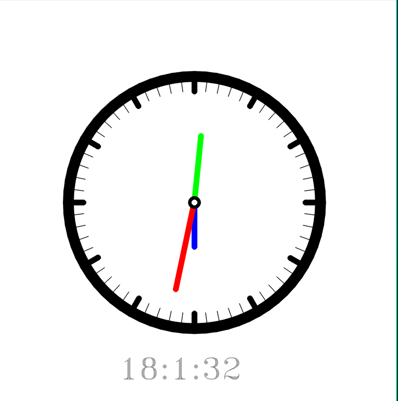

# ANALOG CLOCK USING OPENCV 


## Description
This is a simple analog clock made using OpenCV. The clock is displayed in a window and the time is updated on realtime. The clock has a white background and the clock hands are of diff color. The clock hands are updated every second to show the current time. Digital time is also on the bottom of left corner of the window.

## Requirements
- Python 3.12
- OpenCV
- Numpy


## How to run the code
1. Clone the repository
2. Run the following command in the terminal
```bash
poetry install
```
3. Run the following command in the terminal
```bash
poetry shell
python analog_clock.py
```

## Sample Shot 



